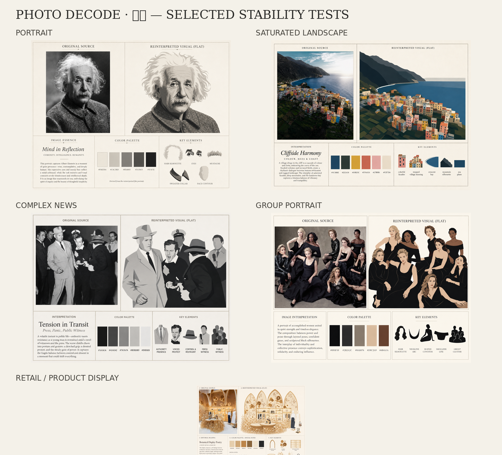

# Photo Decode · 解图

<p align="center">
  <strong>一张图，解出另一种视觉。</strong><br>
  Decode one image into another visual language.
</p>

<p align="center">
  
  
  
  
  
</p>

Photo Decode is a reusable Agent/Codex Skill that turns an uploaded image into a fixed five-block editorial analysis board:

1. **ORIGINAL SOURCE** — the faithful source image
2. **REINTERPRETED VISUAL (FLAT)** — a new background-free flat reconstruction
3. **IMAGE ESSENCE** — concise editorial reading
4. **COLOR PALETTE** — colors derived from the flat reconstruction, with HEX codes
5. **KEY ELEMENTS** — icon-like elements derived from the flat reconstruction

The core transformation is:

> **complex information → extraction → selection → compression → background removal → flattening → new visual object**

## Why it is different

The right-side visual is not a filter, tracing, or vectorized copy. It deliberately removes photographic complexity and rebuilds the subject as a cleaner two-dimensional visual object.

Two dependency rules are strict:

- `COLOR PALETTE` is extracted from the **reinterpreted visual**, not the source.
- `KEY ELEMENTS` are extracted from the **reinterpreted visual**, not the source.

This makes the board one coherent visual system rather than five unrelated analyses.

## Stable five-block contract

```text
ORIGINAL SOURCE
      ↓
REINTERPRETED VISUAL (FLAT)
      ↓
COLOR PALETTE + KEY ELEMENTS
```

`IMAGE ESSENCE` explains the visual logic connecting source and reinterpretation.

## Selected examples



The first public mobile upload uses one contact sheet containing the five latest stable test categories:

- portrait
- saturated landscape
- complex news/documentary scene
- group portrait
- retail / product display

The complete package is also provided as `photo-decode-v1.0.0-full.zip`.

## Supported inputs

- portraits
- group/crowd photos
- news/documentary scenes
- landscapes
- paintings/artworks
- architecture/interiors/installations
- products and retail displays
- advertising/graphic images

## Install in Codex

```bash
mkdir -p ~/.codex/skills
git clone https://github.com/Cloudlake110/photo-decode.git ~/.codex/skills/photo-decode
```

Start a new Codex session if needed.

## Use

Upload an image and say:

```text
Use photo-decode on this image.
```

Chinese:

```text
调用“解图 / Photo Decode”处理这张图片。
```

## Quality gates

The Skill includes hard checks for:

- five-block layout integrity
- true flat reinterpretation
- background removal
- palette dependency
- HEX labels under every swatch
- key-element dependency
- crowd/news hierarchy
- truthfulness and anti-hallucination
- anti-template geometry

See [`references/quality-gates.md`](references/quality-gates.md).

## Documentation

- [`SKILL.md`](SKILL.md) — executable Skill contract
- [`references/transformation-pipeline.md`](references/transformation-pipeline.md) — complex → flat method
- [`references/scene-routing.md`](references/scene-routing.md) — rules by image category
- [`references/layout-spec.md`](references/layout-spec.md) — fixed five-block grid
- [`references/prompt-template.md`](references/prompt-template.md) — prompt compiler
- [`RELEASE_NOTES.md`](RELEASE_NOTES.md) — v1.0.0 release notes

## Public-source declaration

Photo Decode is published as **source-available for personal, educational, research, and other non-commercial use**. It is intentionally **not described as OSI open source**, because the current license contains non-commercial restrictions inherited from the project's rights context. See [`LICENSE.md`](LICENSE.md) and [`NOTICE.md`](NOTICE.md).

Contributions that improve stability, scene routing, evaluation, or documentation are welcome under the same rights framework. See [`CONTRIBUTING.md`](CONTRIBUTING.md).

## Provenance / upstream inspiration

Photo Decode was developed through iterative testing and extends a visual-deconstruction direction inspired in part by **ZzzLc0405/photo-abstract-editorial**. The upstream project is credited in `NOTICE.md`; this repository does not redistribute upstream prompt files, documentation text, or upstream example images.

## Example-image rights

The five selected boards are included as development demonstrations. Some boards contain a source image inside `ORIGINAL SOURCE`. Redistribution rights for source material remain separate from the Skill license; replace or remove any example whose source rights are not cleared for your use.

## Version

**v1.0.0 — Stable first public release candidate**

See [`CHANGELOG.md`](CHANGELOG.md).
