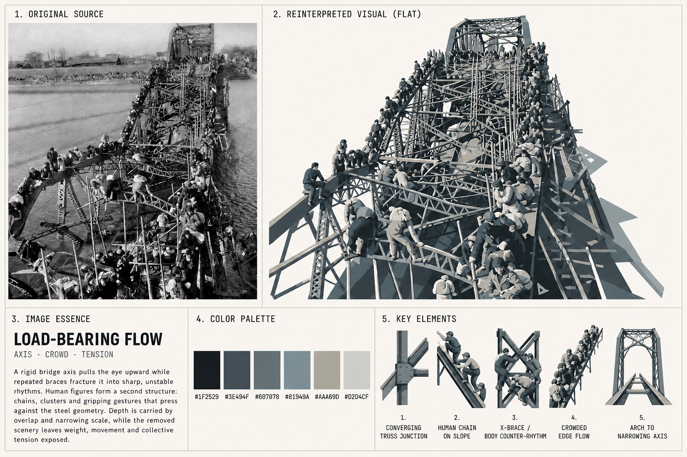
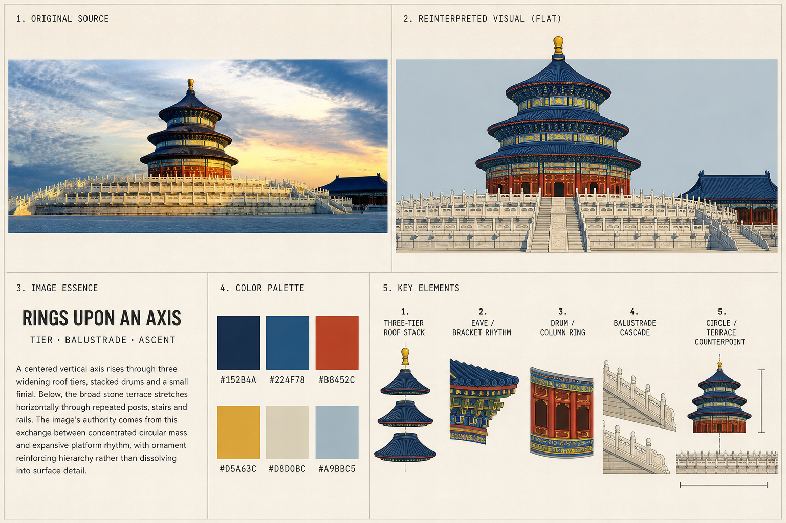

# Photo Decode V2 · 解图

**一张图，解出另一种视觉。**

V2 是一次从零重写，不是给 v1 继续叠补丁。

它重新把“解图”定义成：

> **视觉分析 → 结构提炼 → 去背景 → 信息压缩 → 自适应平面重构 → 从重构图派生色卡 → 重新构造关键视觉语法**

## V2 重点解决两个根本问题

### 1. 不是滤镜

不同图片不能被统一做成版画、蚀刻、漫画、矢量海报等固定风格。

版式统一，但右上主视觉必须服从原图自身的结构、复杂度、线条、纹样、动作与空间关系。

### 2. KEY ELEMENTS 不是截图

关键元素不是把右上图裁几块下来，也不是抠图，更不是一套 SVG 图标。

它们必须被**重新绘制/重新组织**，用来解释：这张图究竟由哪些关键视觉语法构成——形态、关系、节奏、结构节点、动作、符号。

## 固定五区块

1. ORIGINAL SOURCE
2. REINTERPRETED VISUAL (FLAT)
3. IMAGE ESSENCE
4. COLOR PALETTE
5. KEY ELEMENTS

## 示例画廊

查看[八案例 V2 回归测试画廊](examples/v2-regression/README.md)，并排对比源图与完整解图画板。案例覆盖纪实、群体姿态、景观、艺术图、动物、体育动作与华丽建筑，直观展示“版式稳定、重构逻辑随源图变化”。

| 纪实／群体动作 | 华丽建筑 |
| --- | --- |
| [](examples/v2-regression/README.md#01--load-bearing-flow) | [](examples/v2-regression/README.md#08--rings-upon-an-axis) |

## 稳定性承诺

V2 必须在一个完全新的窗口里，仅靠 Skill 本身就能稳定工作。

如果新窗口再次出现：

- 所有图片统一版画化；
- KEY ELEMENTS 变成裁切局部；
- KEY ELEMENTS 变成通用 SVG 图标；
- 五区块漂移；

该输出必须重做，并记录为冷启动回归失败。

## 安装到 Codex

```bash
git clone https://github.com/Cloudlake110/photo-decode.git ~/.codex/skills/photo-decode
```

如果 Skill 没有立即出现，请重新开启 Codex 会话。

## 使用

上传图片后输入：

```text
调用“解图 / Photo Decode”处理这张图片。
```

## 版本

**v2.0.0 — 稳定架构重写版。**

## 许可

本项目以源码公开、非商业许可发布。详见 [`LICENSE.md`](LICENSE.md) 与 [`NOTICE.md`](NOTICE.md)。
