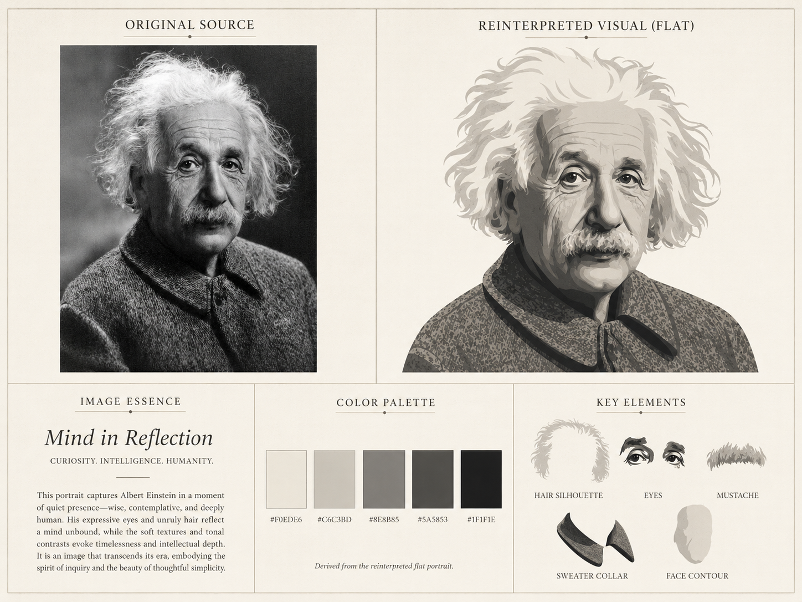
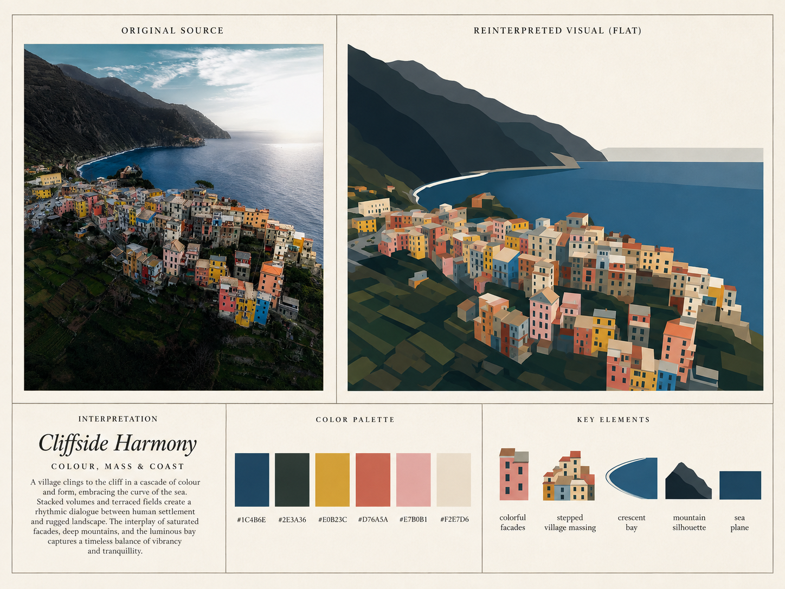
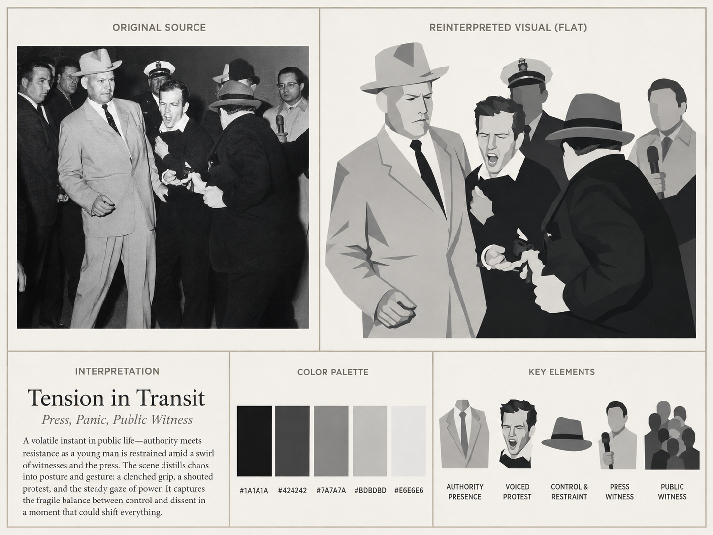
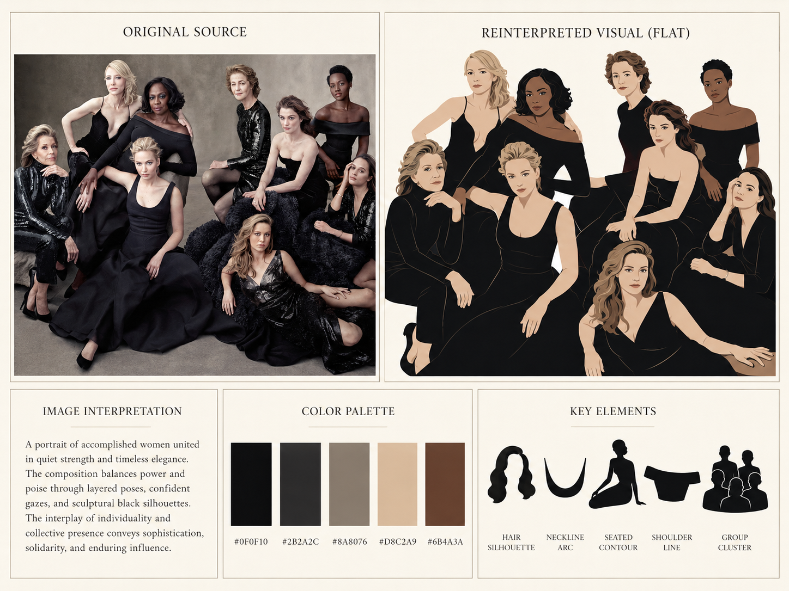
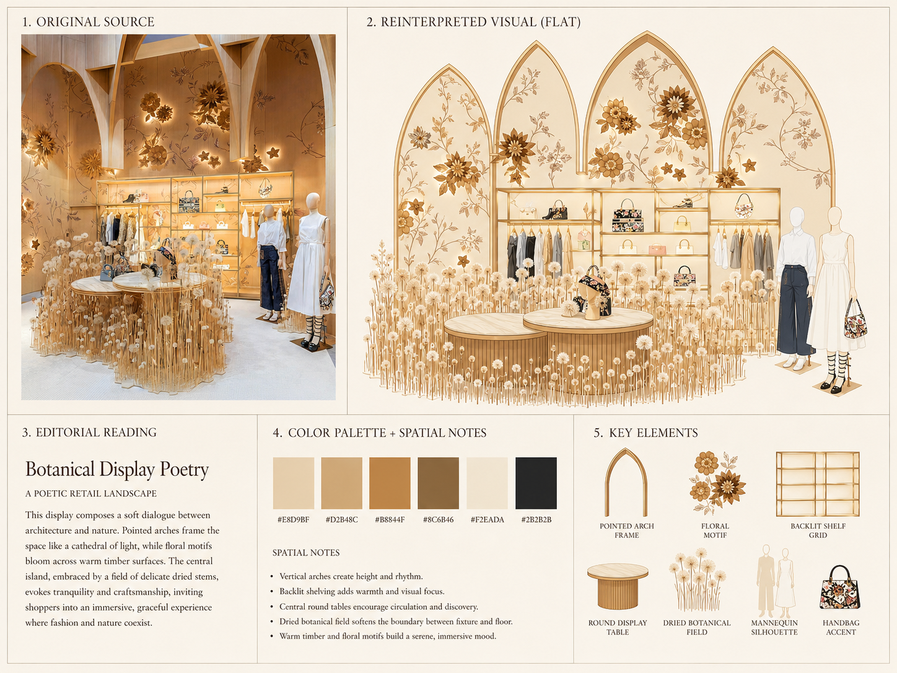

# Photo Decode example gallery

This public gallery contains five selected stability-test boards.

> **Rights note:** each board may embed the source image in its `ORIGINAL SOURCE` block. Before redistribution, confirm that you have the right to redistribute the embedded source. Source-material rights are separate from the Photo Decode Skill license.

## Selected gallery

### 01 · Portrait

### 02 · High-saturation landscape

### 03 · Complex news/documentary scene

### 04 · Group portrait

### 05 · Retail / product display

## What these examples validate

Across all five categories, Photo Decode must keep the same five-block contract:

- `ORIGINAL SOURCE`
- `REINTERPRETED VISUAL (FLAT)`
- `IMAGE ESSENCE`
- `COLOR PALETTE` with HEX labels
- `KEY ELEMENTS`

The palette and key elements must always be derived from the reinterpreted visual, not directly from the original source.
