# Photo Decode V2 — Example Gallery / 示例画廊

These eight cold-start regression cases show what Photo Decode does: the five-block editorial frame stays stable, while the reconstructed visual adapts to the source's own structure, complexity, rhythm and action.

以下八个冷启动回归案例直观展示“解图”的工作方式：五区块版式保持稳定，右侧重构视觉则根据源图自身的结构、复杂度、节奏与动作关系改变。

> These examples demonstrate behavioral diversity, not a single style to imitate. `KEY ELEMENTS` are independently reconstructed visual grammar units, not crops from the board.

> 这些案例展示的是行为多样性，而不是一种固定画风。`KEY ELEMENTS` 是独立重构的视觉语法单元，不是从画板中裁切出的局部。

## 01 — Load-Bearing Flow

Documentary/group action: bridge axis, truss density, human chains and load-bearing tension.

纪实／群体动作：桥梁纵轴、桁架密度、人流链条与承重张力。

| Original source | Photo Decode board |
| --- | --- |
| 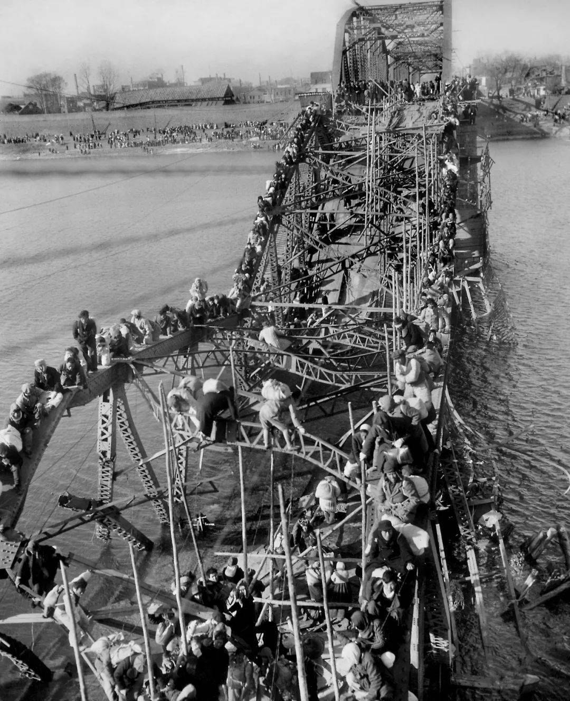 |  |

## 02 — Open-Armed Vector

Group gesture: arm-span axis, suspended stride, approach gap and staggered response.

群体姿态：张臂横轴、悬空步态、接近负空间与错落响应。

| Original source | Photo Decode board |
| --- | --- |
| 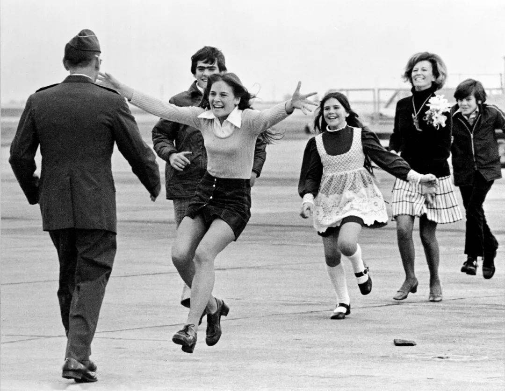 | 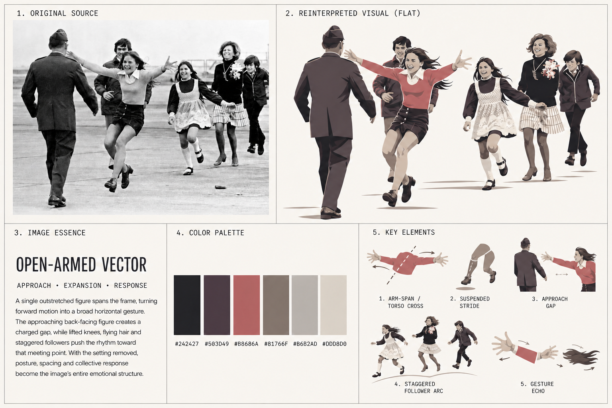 |

## 03 — Weight Above, Motion Below

Landscape/action composite: monumental canopy, architectural hinge and linked running motion.

景观／动作复合：巨大树冠、建筑铰接与牵手奔跑轴线。

| Original source | Photo Decode board |
| --- | --- |
| 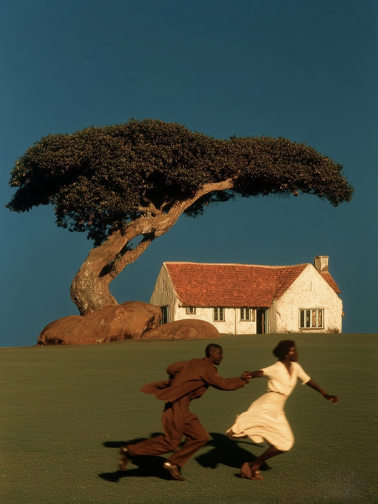 | 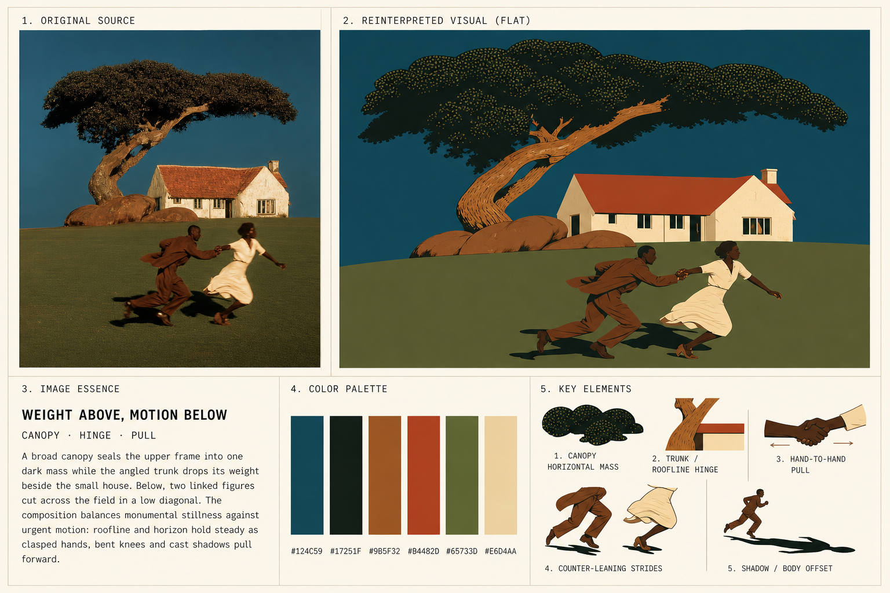 |

## 04 — Figure Beneath Force

Artwork/poster structure: figure-to-mass scale, descending horse form and flame wedge.

艺术图／海报结构：人物与巨型形体的尺度关系、下压马形与火焰楔形。

| Original source | Photo Decode board |
| --- | --- |
| 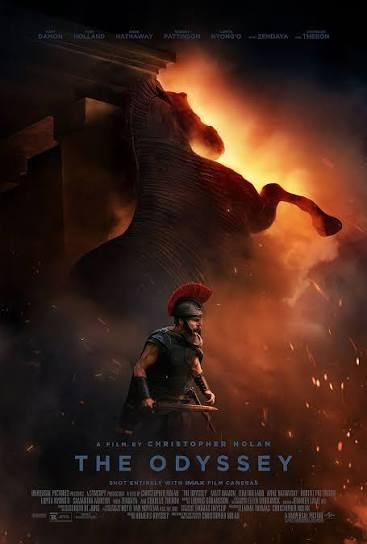 | 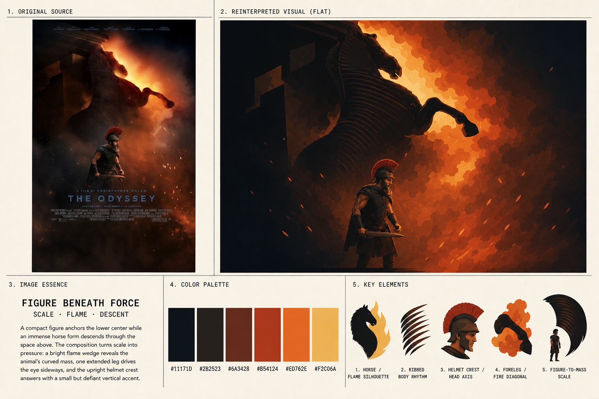 |

## 05 — Mane Against Current

Animal action: eye-to-muzzle axis, mane counter-mass, foreleg anatomy and grass flow.

动物动态：眼—口鼻轴、鬃毛反向体量、前腿解剖与草流节奏。

| Original source | Photo Decode board |
| --- | --- |
| 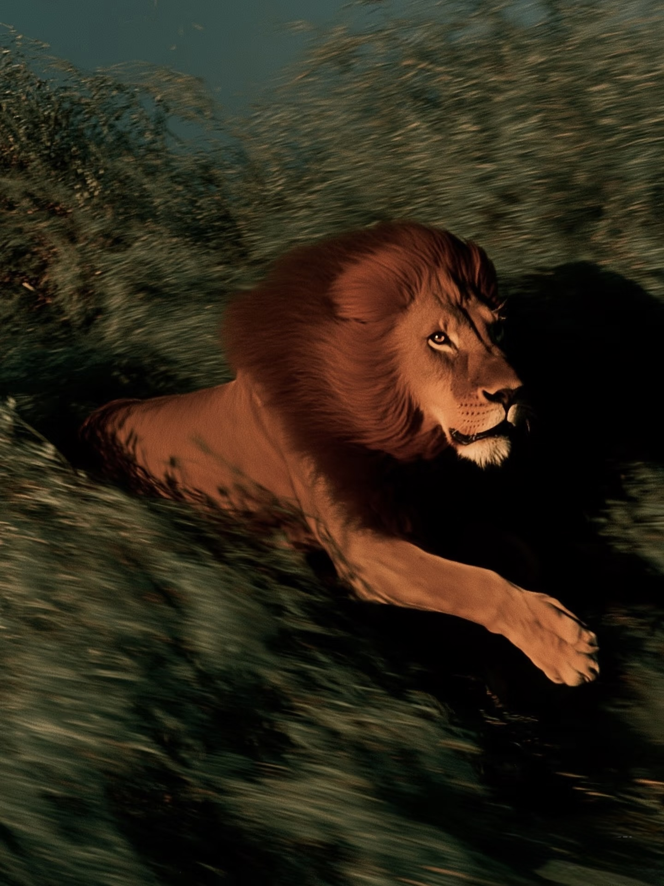 | 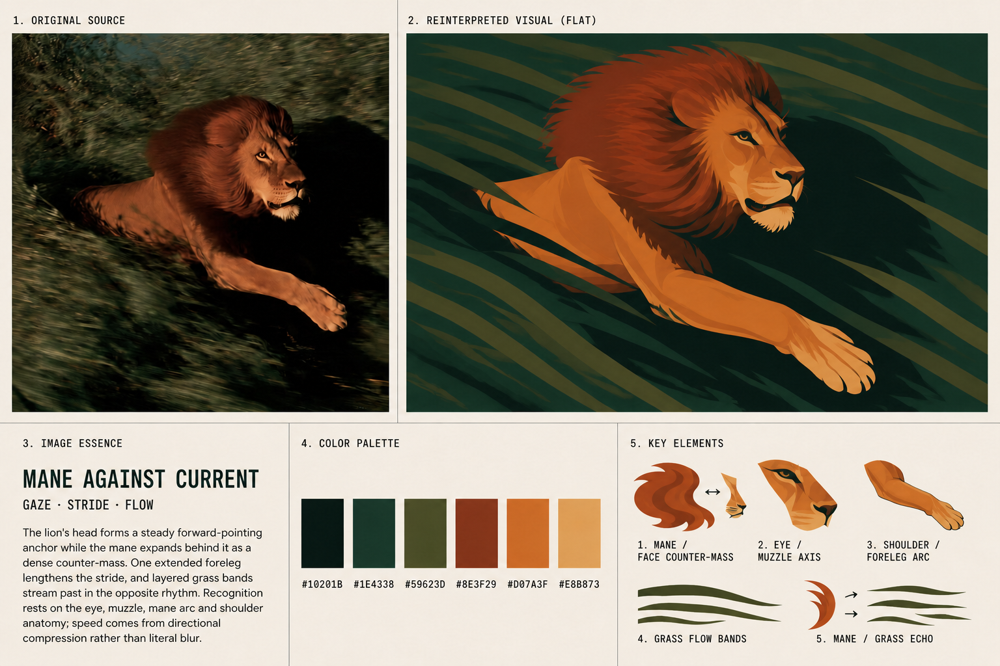 |

## 06 — Contact at the Ridge

Sports/action contact: wheel-body hinge, compressed crowd, handlebar leverage and counter-diagonal.

体育／动作接触：车轮—身体铰点、群体压缩、车把杠杆与反斜线。

| Original source | Photo Decode board |
| --- | --- |
| 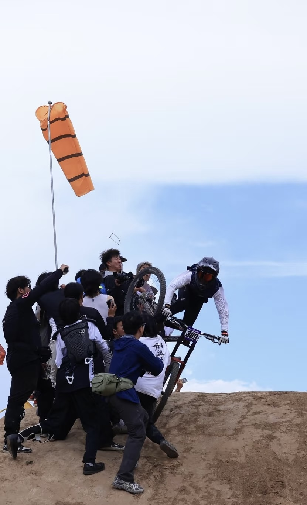 | 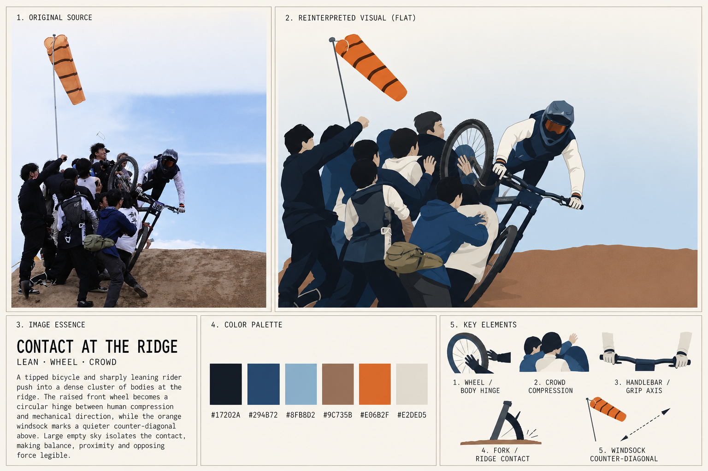 |

## 07 — Contours Hold the Mist

Landscape topology: terrace density, water-ridge alternation, settlement nesting and mist occlusion.

景观拓扑：梯田密度、水面—田埂交替、聚落嵌套与雾带遮挡。

| Original source | Photo Decode board |
| --- | --- |
| 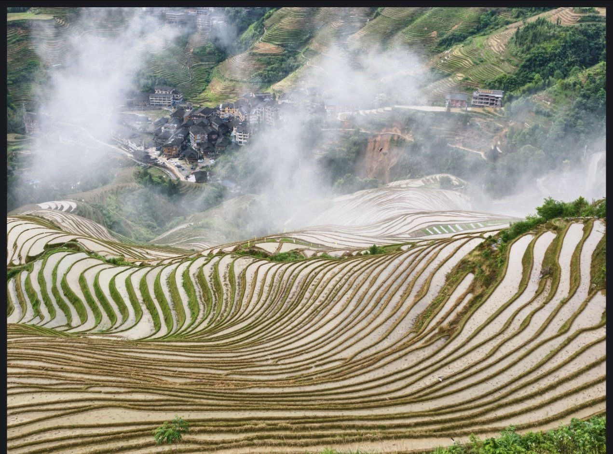 | 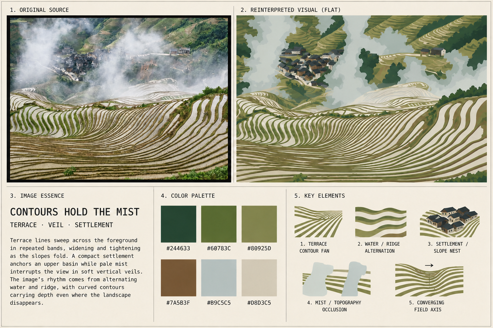 |

## 08 — Rings Upon an Axis

Ornate architecture: roof-tier ratios, column rings, bracket rhythm and balustrade cascade.

华丽建筑：屋顶层级比例、圆形柱带、檐下构件节奏与栏杆级联。

| Original source | Photo Decode board |
| --- | --- |
|  |  |

## What stays fixed / 什么保持不变

Every final board contains exactly five blocks:

1. `ORIGINAL SOURCE`
2. `REINTERPRETED VISUAL (FLAT)`
3. `IMAGE ESSENCE`
4. `COLOR PALETTE`
5. `KEY ELEMENTS`

The layout is stable; the reconstruction logic is source-adaptive.

五区块版式始终稳定，重构逻辑则随源图变化。
